Natividad Márquez Baena

# Práctica 3.1: Instalación de Tomcat

1. Introducción e instalación de tomcat
2. Despliegue manual mediante la GUI de administración
3. Despliegue con Maven
    3.1 Instalacion de Maven
    3.2 Configuración de Maven
    3.3 Despliegue

## Introducción e instalación de tomcat
Esta práctica se centra en el despliegue de aplicaciones en un servidor Tomcat utilizando diferentes métodos, incluyendo el despliegue manual y el automatizado mediante Maven. El entorno que se va a utilizar es Debian 12.
Se procede a la instalación de Tomcat

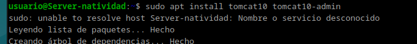

Posteriormente a la configuración de usuarios. Para ello se modifica el archivo `tomcat-users.xml`, para añadir usuarios y roles necesarios, especialmente:
Un usuario con rol manager-gui para la administración.
Un usuario con rol manager-script para despliegues.

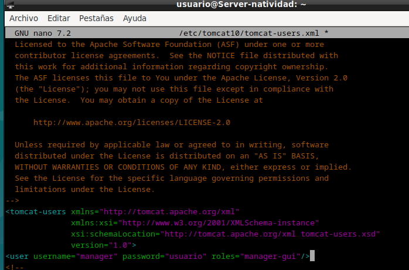

Se comprueba el estado del tomcat y se observa activo y funcionando correctamente.

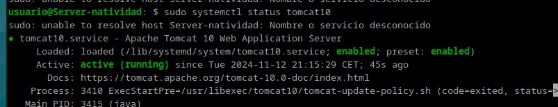

Posteriormente se reinicia el servicio de tomcat para que se apliquen los cambios.

## Despliegue Manual Mediante la GUI de Administración
Se accede  a la dirección `http://localhost:8080/nombre_usuario/html`, usando el nombre de usuario y la contraseña que se ha establecido previamente:

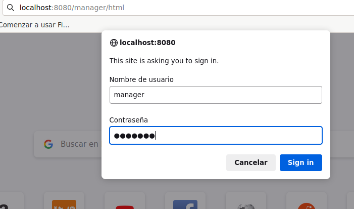
Una vez accedemos al tomcat comprobamos su funcionamiento mediante un archivo `.war`. Sin embargo, el archivo proporcionado no funciona correctamente así que se ha realizado la comprobación con un archivo distinto. El archivo de ejemplo se obtendrá desde la siguiente dirección:
`https://tomcat.apache.org/tomcat-6.0-doc/appdev/sample/`

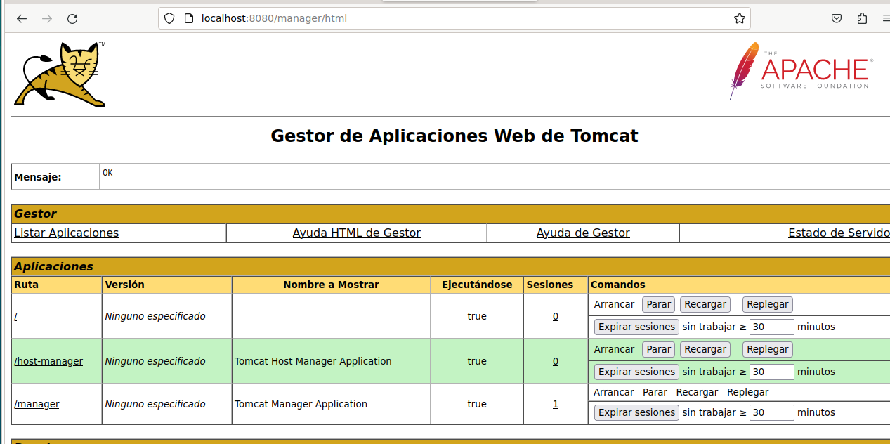

Se despliega el archivo en tomcat y se comprueba si se ha hecho correctamente.

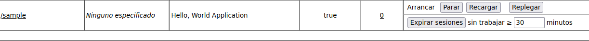
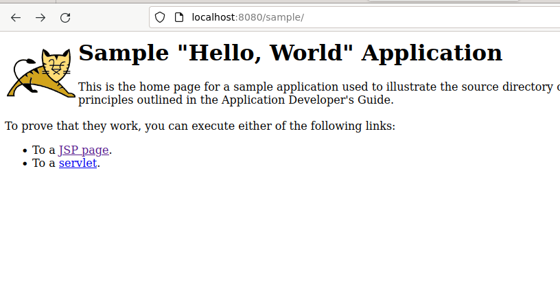

## Despliegue con Maven
Primeramente se instala Maven

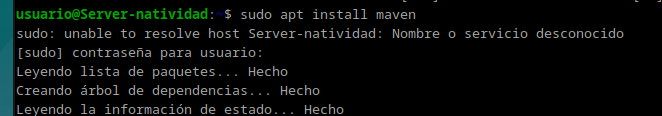

Ahora se procederá a añadir un nuevo usuario a al archivo `tomcat-users.xml` para poder desplegar con Maven. Para ello se modifica el mismo archivo de configuración.

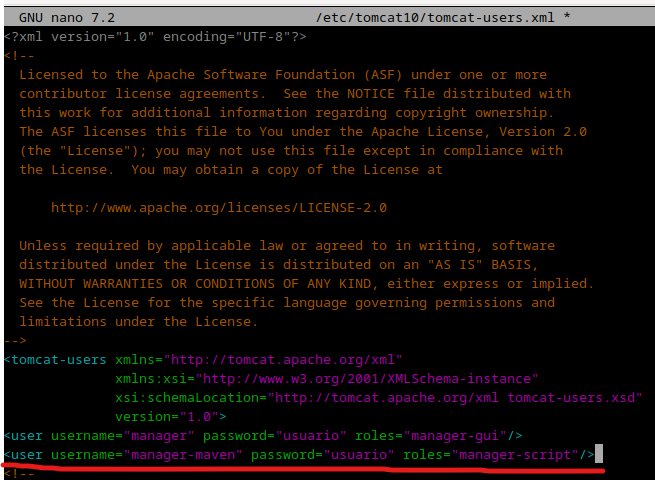

Hecho esto, se procederá a configurar Maven. Para ello, se deberá modificar el archivo `settings.xml`.

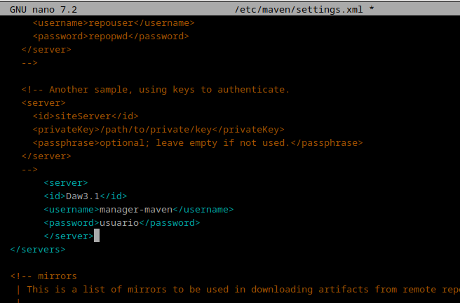

Posteriormente se clona el repositorio de ejemplo que se nos ha facilitado y se procederá a desplegarlo con Maven.

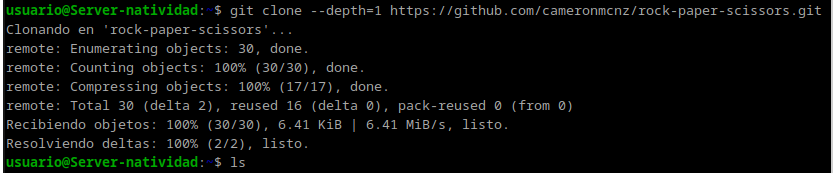
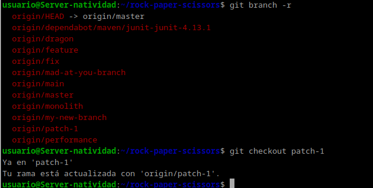

Además se modificará el archivo `pom.xml` para añadir la configuración, añadiendo cambios dentro de la etiqueta plugin.

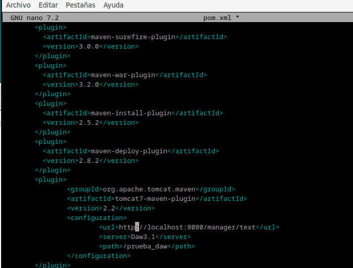

Para comprobar que todo funciona correctamente se ejecuta el comando `mvn tomcat7:deploy`, y esperamos a que nos de como resultado un mensaje de confirmación.

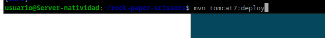
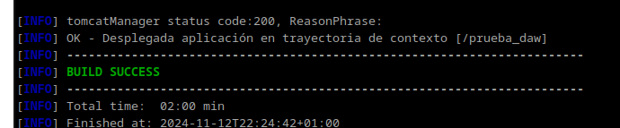

Accediendo de nuevo a la dirección `http://localhost:8080/nombre_usuario/`, esta vez con el usuario para maven.

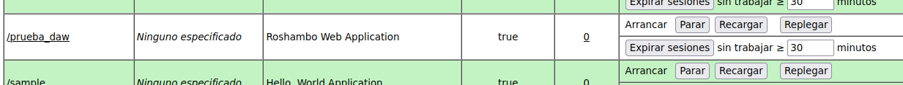

Debería de aparecer el directorio y se podrá desplegar:

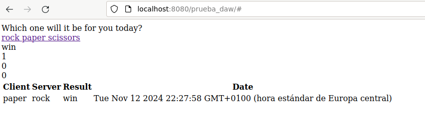

